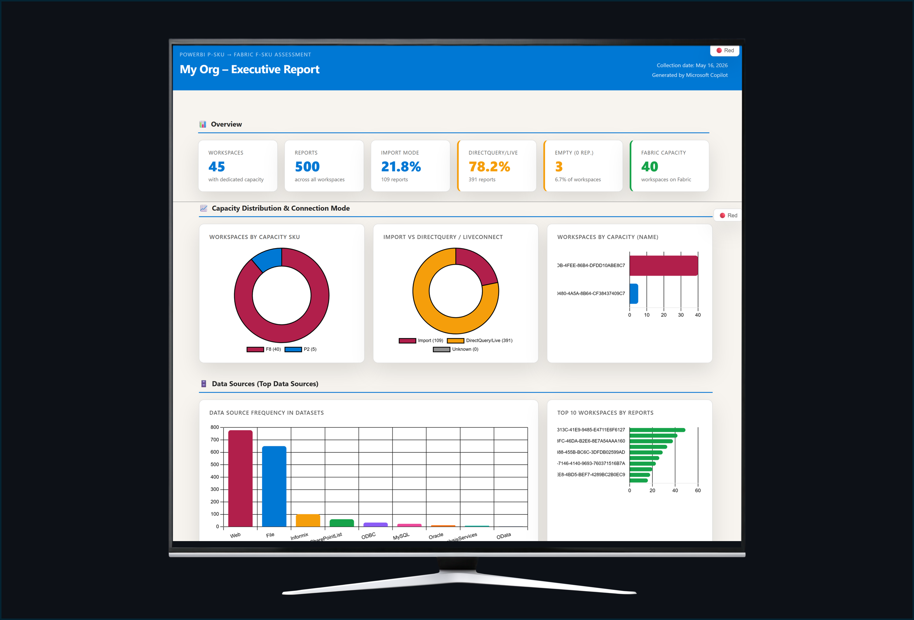

# PowerBI P-SKU → Fabric F-SKU Assessment

A set of PowerShell scripts that collect the metadata, report inventory, usage metrics, and audit logs needed to evaluate a **Power BI Premium (P-SKU)** tenant and plan a migration to **Microsoft Fabric (F-SKU)** capacities.

---

## Why this tool?

Microsoft Fabric introduces F-SKU capacities that replace the traditional Power BI Premium P-SKU model. Before migrating, organisations need to answer:

| Question | Answered by |
|---|---|
| Which workspaces are on which capacity (name, SKU, type)? | Script 01 |
| How many reports and datasets live in each workspace? | Scripts 01 & 02 |
| What dataset storage format is in use — including Large Semantic Model (LSM)? | Scripts 01 & 02 |
| What is the dataset connectivity mode (Import vs DirectQuery / Live Connect)? | Script 02 |
| Which reports are actively used, and by how many people? | Script 03 |
| What activities (refresh, export, share, create, delete) are happening across the tenant? | Script 04 |
| How do I present all findings to stakeholders in a single shareable document? | Script 10 |

---

## Repository structure

```
Assessment/
├── 01-Get-PowerBIWorkspaces.ps1          # Step 1  — Workspace & capacity inventory
├── 02-Get-PowerBIReportsByWorkspace.ps1  # Step 2  — Report & dataset metadata
├── 03-Get-UsageMetricByReport.ps1        # Step 3  — Usage & adoption metrics
├── 04-Get-FabricAuditLogs.ps1            # Step 4  — Fabric / Power BI audit logs
├── 99-Generate-ExecutiveReport.ps1       # Step 10 — Interactive HTML executive report
├── Run-Scripts.bat                       # Menu-driven launcher (Windows)
├── Input/                                # (reserved for future input files)
└── Output/                               # All JSON outputs land here
```

---

## Script pipeline

```
01-Get-PowerBIWorkspaces.ps1
        │
        │  Output\PowerBI_Workspaces.json
        ▼
02-Get-PowerBIReportsByWorkspace.ps1
        │
        │  Output\PowerBI_Reports_By_WS_<Workspace>.json  (one per workspace)
        │  Output\PowerBI_Reports_All_Workspaces.json     (combined summary)
        ▼
03-Get-UsageMetricByReport.ps1
        │
        │  Output\PowerBI_UsageMetrics_<Workspace>.json   (one per workspace)
        │  Output\PowerBI_UsageMetrics_All.json           (combined)
        ▼
04-Get-FabricAuditLogs.ps1    (independent — can run at any time)
        │
        │  Output\Fabric_AuditLog_Raw_<date>.json
        └─ Output\Fabric_AuditLog_Summary_<date>.json

99-Generate-ExecutiveReport.ps1   (runs after scripts 01 & 02 — reads their output)
        │
        │  <OutputFolder>\Executive_Report_<CustomerName>.html
        └─ Self-contained interactive HTML file (no server required)
```

Scripts 01 → 02 → 03 must run **in order**. Script 04 is independent. Script 10 requires only the output of scripts 01 and 02.

---

## Prerequisites

### PowerShell module

```powershell
# Set execution policy (once per machine)
Set-ExecutionPolicy -ExecutionPolicy RemoteSigned -Scope CurrentUser

# Install the Power BI Management module
Install-Module -Name MicrosoftPowerBIMgmt -Scope CurrentUser -Force -AllowClobber
```

### Permissions

| Permission | Required by | How to grant |
|---|---|---|
| **Power BI Administrator** role in Entra ID | All scripts | Microsoft 365 admin center → Users → Manage roles |
| `Tenant.Read.All` API permission (service principal) | All scripts | Azure portal → App registrations → API permissions → Admin consent |
| **Allow service principals to use read-only Power BI admin APIs** | Scripts 01–04 | Power BI Admin portal → Tenant settings → Developer settings |
| **Enhance admin APIs responses with detailed metadata** | Script 02 (Scanner API tables/measures only — optional) | Power BI Admin portal → Tenant settings → Admin API settings |
| **Usage metrics for content creators** enabled | Script 03 | Power BI Admin portal → Tenant settings → Audit and usage settings |

> **Note:** The Fabric Administrator role alone is **not sufficient** for the Activity Events API. The account must have the **Power BI Administrator** role in Entra ID.

---

## Quick start

### Option A — Interactive (browser / MFA)

```powershell
cd Assessment
.\01-Get-PowerBIWorkspaces.ps1
.\02-Get-PowerBIReportsByWorkspace.ps1
.\03-Get-UsageMetricByReport.ps1
.\04-Get-FabricAuditLogs.ps1

# Generate the executive report (Portuguese, default)
.\99-Generate-ExecutiveReport.ps1 -OutputFolder .\Output -CustomerName "My Customer"

# English / Spanish / Portugese variants
.\99-Generate-ExecutiveReport.ps1 -OutputFolder .\Output -CustomerName "My Customer" -Language 1
.\99-Generate-ExecutiveReport.ps1 -OutputFolder .\Output -CustomerName "My Customer" -Language 2
.\99-Generate-ExecutiveReport.ps1 -OutputFolder .\Output -CustomerName "My Customer" -Language 3
```

### Option B — Service principal

```powershell
$secret = ConvertTo-SecureString "your-client-secret" -AsPlainText -Force

.\01-Get-PowerBIWorkspaces.ps1    -TenantId "<tid>" -ClientId "<cid>" -ClientSecret $secret
.\02-Get-PowerBIReportsByWorkspace.ps1 -TenantId "<tid>" -ClientId "<cid>" -ClientSecret $secret
.\03-Get-UsageMetricByReport.ps1  -TenantId "<tid>" -ClientId "<cid>" -ClientSecret $secret
.\04-Get-FabricAuditLogs.ps1      -TenantId "<tid>"
```

### Option C — Windows menu launcher

```
Run-Scripts.bat
```

---

## Script reference

### `01-Get-PowerBIWorkspaces.ps1` — Workspace & capacity inventory

Fetches all workspaces that are on a **dedicated capacity** (Premium P-SKU or Fabric F-SKU). Non-dedicated (Pro) workspaces are excluded.

**What it collects per workspace:**

| Field | Description |
|---|---|
| `Id` / `Name` | Workspace GUID and display name |
| `CapacityId` | GUID of the assigned capacity |
| `CapacityName` | Display name of the capacity |
| `CapacitySku` | SKU identifier — e.g. `P1`, `P3`, `F4`, `F64` |
| `CapacityType` | `PBI Premium Capacity` or `Fabric Capacity` |
| `DefaultDatasetStorageFormat` | `Small` (standard) or `Large` (**LSM enabled** for the workspace) |
| `ReportCount` | Number of reports in the workspace |
| `IsOnDedicatedCapacity` / `IsReadOnly` | Capacity and access flags |
| `Users` | List of workspace members (UPN + access right) |

**Output:** `Output\PowerBI_Workspaces.json`

**Parameters:**

| Parameter | Default | Description |
|---|---|---|
| `-OutputJson` | `.\Output\PowerBI_Workspaces.json` | Output file path |
| `-TenantId` | — | Azure AD Tenant ID (service principal auth) |
| `-ClientId` | — | App Registration Client ID |
| `-ClientSecret` | — | Client secret as `SecureString` |

---

### `02-Get-PowerBIReportsByWorkspace.ps1` — Report & dataset metadata

Reads the workspace list from script 01, issues a single **batched Scanner API** call for all workspaces, then enriches each report with its dataset metadata. Datasources are fetched directly via the Admin API (`GET admin/datasets/{datasetId}/datasources`) for reliable results — independent of the "Enhance admin APIs" tenant setting.

**What it collects per report:**

| Field | Description |
|---|---|
| `ReportId` / `ReportName` / `WebUrl` / `EmbedUrl` | Report identifiers and URLs |
| `Dataset.DatasetId` | Linked dataset GUID |
| `Dataset.ConnectionMode` | `Import` or `DirectQuery_or_LiveConnect` (derived from `isRefreshable`) |
| `DataSources` | Array of data sources — `datasourceName` (type) and `connectionDetails` (server/database/URL etc.) — fetched per dataset via the Admin API |

**Workspace-level fields also included in output:**

| Field | Description |
|---|---|
| `DefaultDatasetStorageFormat` | Workspace LSM setting (`Small` / `Large`) |
| `CapacityName` / `CapacitySku` / `CapacityType` | Capacity details from script 01 |

**Outputs:**
- `Output\PowerBI_Reports_By_WS_<WorkspaceName>.json` — full detail per workspace
- `Output\PowerBI_Reports_All_Workspaces.json` — flat combined summary (input for script 03)

**Parameters:**

| Parameter | Default | Description |
|---|---|---|
| `-InputJson` | `.\Output\PowerBI_Workspaces.json` | Workspace list from script 01 |
| `-TenantId` / `-ClientId` / `-ClientSecret` | — | Authentication |

---

### `03-Get-UsageMetricByReport.ps1` — Usage & adoption metrics

Reads the combined report list from script 02 and collects up to **90 days** of `ViewReport` and `ShareReport` events from the Power BI Activity Events API. One API call is made per day; continuation tokens handle pagination.

**What it computes per report:**

| Metric | Description |
|---|---|
| `TotalViews` | Total report opens in the period |
| `TotalUniqueViewers` | Distinct users who opened the report |
| `TotalShares` | Number of share events |
| `RankByTotalViewsInOrg` | Rank of this report vs all reports in the tenant |
| `ViewsPerDay` | Daily view count time-series |
| `UniqueViewersPerDay` | Daily unique viewer count time-series |
| `ViewsPerUser` | Per-user view count breakdown |
| `SharesPerDay` | Daily share count time-series |
| `MostViewedPages` | Page-level view breakdown |
| `AccessMethodBreakdown` | Web vs Mobile vs other consumption methods |

**Outputs:**
- `Output\PowerBI_UsageMetrics_<WorkspaceName>.json` — per workspace
- `Output\PowerBI_UsageMetrics_All.json` — combined

**Parameters:**

| Parameter | Default | Description |
|---|---|---|
| `-InputJson` | `.\Output\PowerBI_Reports_All_Workspaces.json` | Report list from script 02 |
| `-DaysBack` | `90` | Days of history (max 90) |
| `-TenantId` / `-ClientId` / `-ClientSecret` | — | Authentication |

---

### `04-Get-FabricAuditLogs.ps1` — Fabric / Power BI audit logs

Exports audit records from the **Power BI Activity Events API** for the entire organisation. Covers a comprehensive set of activities across reports, dashboards, datasets, dataflows, apps, and workspaces.

**Activity types collected by default:**

`ViewReport`, `ExportReport`, `ExportArtifact`, `DatasetRefresh`, `ShareReport`, `ShareDashboard`, `CreateReport`, `EditReport`, `DeleteReport`, `PublishToWebReport`, `ViewDashboard`, `CreateDataset`, `DeleteDataset`, `CreateDataflow`, `DeleteDataflow`, `RefreshDataflow`, `CreateApp`, `UpdateApp`, `DeleteApp`, `CreateWorkspace`, `UpdateWorkspace`, `DeleteWorkspace`, `AddGroupMembers`, `DeleteGroupMembers`, and more.

**Output files:**

| File | Contents |
|---|---|
| `Fabric_AuditLog_Raw_<date>.json` | Every raw audit record with all fields |
| `Fabric_AuditLog_Summary_<date>.json` | Aggregated per-user, per-activity, and per-artifact breakdowns |

**Parameters:**

| Parameter | Default | Description |
|---|---|---|
| `-DaysBack` | `90` | Days of history (max 90 for E3; up to 1 year for E5/A5) |
| `-UserPrincipalName` | — | Filter to a single user (omit for org-wide) |
| `-Activities` | (comprehensive default list) | Override to collect specific activity types only |
| `-TenantId` | — | Tenant ID for disambiguation |
| `-OutputDir` | `.\Output` | Output folder |

---

### `10-Generate-ExecutiveReport.ps1` — Interactive HTML executive report

Reads the JSON output from scripts 01 and 02 and generates a **self-contained, single-file HTML report** that opens directly in any browser — no server, no dependencies beyond an internet connection for Chart.js.



**Report sections:**

| Section | Contents |
|---|---|
| Header | Customer name, collection date, link to this repository |
| KPI Grid | Workspaces, Reports, Import %, DirectQuery %, Empty workspaces, Fabric workspaces |
| Fabric Adoption | Fabric vs Premium split, SKU, capacity name, Large Semantic Model status |
| Capacity & Connection | Doughnut charts by SKU and connection mode; bar chart by capacity name |
| Data Sources | Top 10 data source types (bar chart) + Top 10 workspaces by report count |
| Workspace Table | Full sortable inventory with capacity, SKU, report count, storage format, and mini bar |
| Findings & Recommendations | Up to 8 auto-generated insight cards (Import dominance, Fabric adoption stage, empty workspaces, LSM, ODBC/Oracle, file/web sources, top-3 concentration) |

**Theme toggle:** The report includes a 🔵 Blue / 🔴 Red theme switcher (both light-background themes) accessible via the fixed button in the top-right corner.

**Parameters:**

| Parameter | Default | Description |
|---|---|---|
| `-OutputFolder` | `.\Output-BRA` | Folder containing `PowerBI_Workspaces.json` and `PowerBI_Reports_All_Workspaces.json` |
| `-CustomerName` | Folder name | Customer display name used in the report title and header |
| `-ReportPath` | `<OutputFolder>\Executive_Report_<CustomerName>.html` | Full path for the generated HTML file |
| `-Language` | `3` | `1` = English · `2` = Spanish · `3` = Portuguese (pt-BR) |

**Output:** `<OutputFolder>\Executive_Report_<CustomerName>.html`

**Examples:**

```powershell
# Portuguese (default) — Contoso Brazil
.\99-Generate-ExecutiveReport.ps1 -OutputFolder .\Output-BRA -CustomerName "Contoso Brazil"

# Spanish — Zafra Mexico
.\99-Generate-ExecutiveReport.ps1 -OutputFolder .\Output-Zafra -CustomerName "Zafra Mexico" -Language 2

# English
.\99-Generate-ExecutiveReport.ps1 -OutputFolder .\Output -CustomerName "Contoso" -Language 1
```

---

## Output file reference

| File | Produced by | Description |
|---|---|---|
| `PowerBI_Workspaces.json` | Script 01 | All dedicated-capacity workspaces with capacity and LSM metadata |
| `PowerBI_Reports_By_WS_<name>.json` | Script 02 | Full report + dataset detail for one workspace |
| `PowerBI_Reports_All_Workspaces.json` | Script 02 | Flat summary of all reports across all workspaces |
| `PowerBI_UsageMetrics_<name>.json` | Script 03 | Per-report usage metrics for one workspace |
| `PowerBI_UsageMetrics_All.json` | Script 03 | Combined usage metrics across all workspaces |
| `Fabric_AuditLog_Raw_<date>.json` | Script 04 | Raw audit events |
| `Fabric_AuditLog_Summary_<date>.json` | Script 04 | Aggregated activity summary |
| `Executive_Report_<CustomerName>.html` | Script 10 | Self-contained interactive HTML executive report |

---

## Large Semantic Model (LSM) detection

The `DefaultDatasetStorageFormat` field in `PowerBI_Workspaces.json` is the **workspace-level** LSM setting:

| Value | Meaning |
|---|---|
| `Small` | Standard storage (default). Semantic models are limited to ~1 GB in memory. |
| `Large` | **LSM enabled.** Semantic models can grow up to the capacity size. Requires Premium or Fabric capacity. |

This setting is found in the Power BI workspace **Advanced settings** and is returned by the Admin API (`GET admin/groups/{groupId}`). It applies to all semantic models in the workspace.

---

## Fabric capacity SKU reference

| SKU | vCores | Max memory per semantic model |
|---|---|---|
| F2 | 2 | 3 GB |
| F4 | 4 | 6 GB |
| F8 | 8 | 12 GB |
| F16 | 16 | 24 GB |
| F32 | 32 | 48 GB |
| F64 | 64 | 96 GB |
| F128 | 128 | 192 GB |
| F256 | 256 | 384 GB |
| F512 | 512 | 768 GB |
| F1024 | 1024 | 1,536 GB |

For comparison, Power BI Premium P-SKUs: P1 = 8 vCores / 25 GB, P2 = 16 / 50 GB, P3 = 32 / 100 GB, P4 = 64 / 200 GB, P5 = 128 / 400 GB.

---

## Security notes

- **Never commit credentials or client secrets** to this repository.  
- Use environment variables or Azure Key Vault references when automating with a service principal.  
- The `Output/` folder contains tenant metadata. Treat it as confidential and add it to `.gitignore` before pushing to a shared repository.

```gitignore
Output/
```
